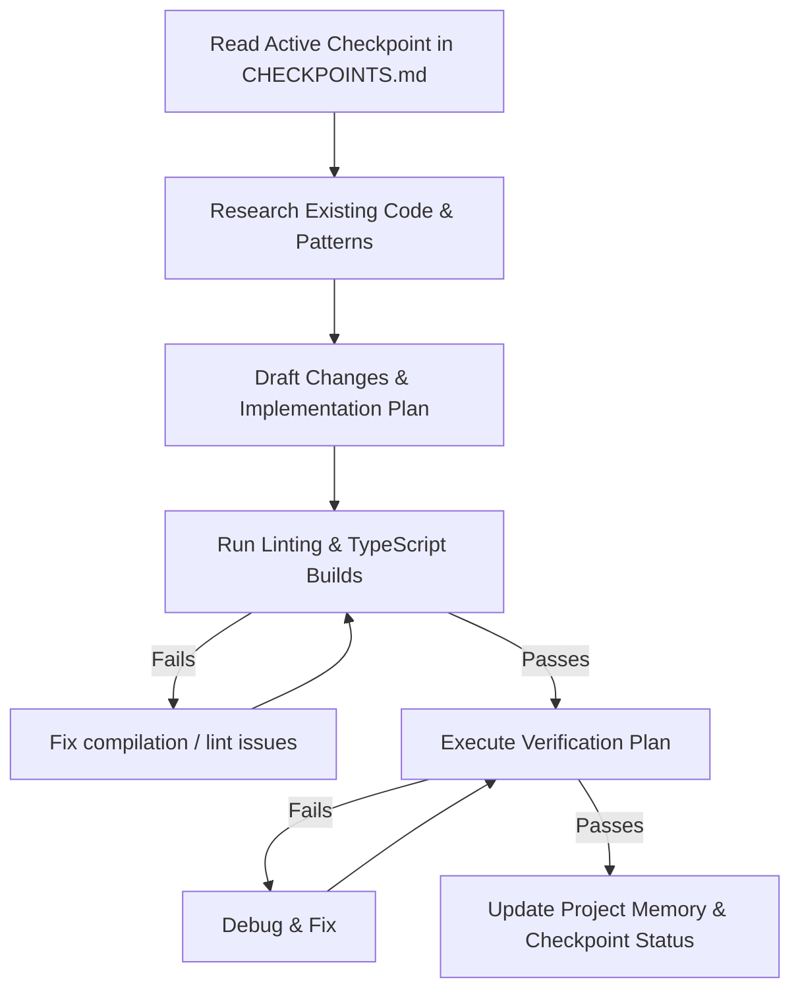

# AI Workflow Manual

This document acts as the permanent operational manual for future AI sessions working on the School ERP System. It defines the rules, reading order, and coding workflows to maintain structural integrity and prevent regression.

---

## 1. Core Operating Principles

- **Never assume framework defaults**: Always inspect the existing code and configuration files. Standardize configurations instead of assuming library defaults.
- **Always inspect before implementing**: Search the repository for existing patterns, shared utilities, constants, or types. Avoid duplicating infrastructure or creating bespoke implementations.
- **Always verify before marking complete**: Run typescript compilation, builds, and linting locally. Test endpoints via curl or other verification routines before declaring success.
- **Maintain project memory**: Always update the files inside `.project/` at the end of each session.

---

## 2. Project Memory & Repository Discovery

When starting a new session, follow this reading order to synchronize context:

1. **`.project/SESSION_HANDOFF.md`**: Understand the immediate handover state, recent changes, and recommended next step.
2. **`.project/CURRENT_PROGRESS.md`**: Understand what has been completed across all milestones.
3. **`.project/PROJECT_STATUS.md`**: Check the current status of baseline builds and active milestones.
4. **`task.md`**: Review the current list of checklist targets.
5. **`walkthrough.md`**: Review historical walkthrough summaries of features.
6. **`docs/`** (e.g. `docs/ARCHITECTURE.md`, `docs/DATABASE.md`): Review architecture and database conventions.

---

## 3. Engineering Workflow

For every logical change, follow this sequence:

---

## 4. Verification Workflow

Every modification must pass verification:
- **Lint Check**: Run `npm run lint` in both `frontend` and `backend`. All lint errors and warnings must be resolved before commit.
- **Type Check**: Execute `npx tsc --noEmit` on backend and appropriate typescript check on frontend to ensure zero type issues.
- **Build Check**: Ensure `npm run build` succeeds on both backend and frontend.
- **API Tests**: Verify changes to routes via `curl` to guarantee expected response codes and structures.

---

## 5. Repository Update & Commit Strategy

- Commit messages must follow the Conventional Commits format (e.g. `feat(auth): ...` or `fix(prisma): ...`).
- Commits must represent completed checkpoints, not arbitrary files or partial implementations.
- Never commit broken code, failing builds, or unlinted changes.
- Sync project memory files (`.project/*`, `task.md`, `walkthrough.md`) at the end of the checkpoint implementation, and include them in the checkpoint commit.
